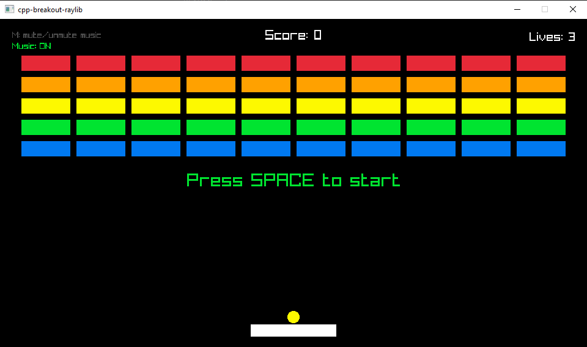
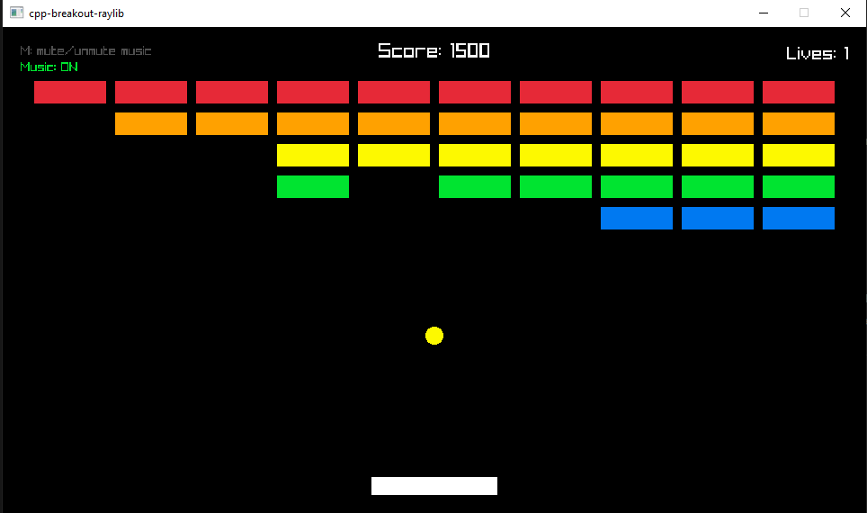
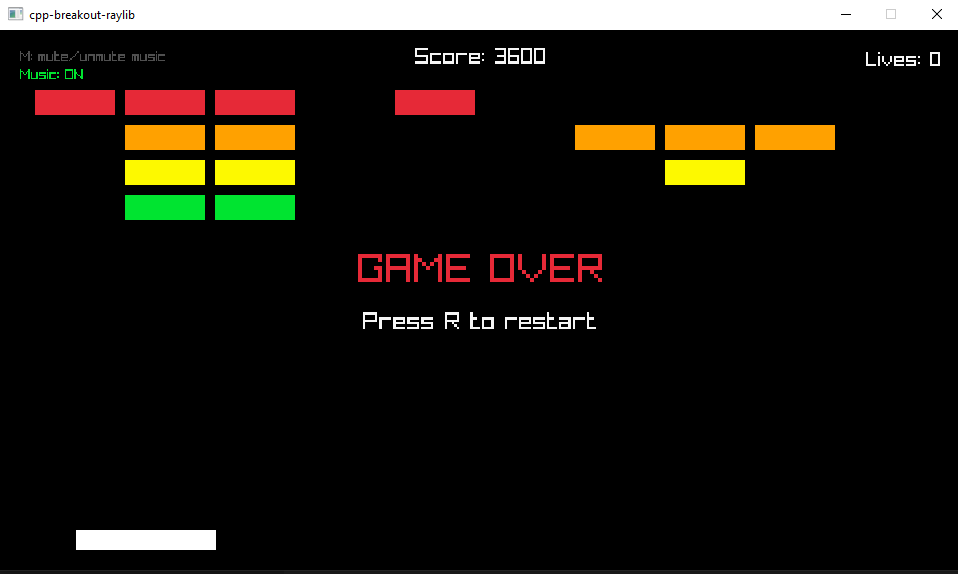

# C++ Breakout + Raylib

A small Breakout-style arcade game written in C++ with [raylib](https://www.raylib.com/). Move the paddle, keep the ball alive, clear all of the bricks, and listen as the procedural soundtrack reacts to the match.

## Requirements

- CMake 3.24 or newer
- A C++17 compiler
- An audio device for the procedural music

The CMake project downloads raylib 5.5 with `FetchContent` during the first configure step. If you already have the `build` directory from a previous configure, rebuilding can work without downloading it again.

## Build And Run

From the project root:

```powershell
cmake -S . -B build
cmake --build build
.\build\raylib-game-template\raylib-game-template.exe
```

On a multi-config generator such as Visual Studio, build and run with the chosen configuration:

```powershell
cmake -S . -B build-vs -G "Visual Studio 17 2022" -A x64
cmake --build build-vs --config Debug
.\build-vs\raylib-game-template\Debug\raylib-game-template.exe
```

The game opens a `960x540` window named `cpp-breakout-raylib`.



## How To Play

The round starts with the ball attached to the paddle. Move into position, then launch the ball and keep it from falling below the screen.

| Action | Key |
| --- | --- |
| Move left | `Left Arrow` or `A` |
| Move right | `Right Arrow` or `D` |
| Launch ball | `Space` |
| Restart after win or game over | `R` |
| Mute or unmute procedural music | `M` |



Gameplay rules:

- You start with `3` lives.
- Each destroyed brick gives `100` points.
- The layout contains `5` rows and `10` columns of bricks.
- The ball bounces off the side walls, ceiling, paddle, and bricks.
- Hitting the paddle away from the center adds more horizontal speed, so edge hits are useful for sharper angles.
- You win when all bricks are destroyed.
- You lose a life when the ball falls below the bottom of the window.
- When all lives are gone, the game enters the game over screen.

The HUD shows the score at the top center, lives at the top right, and procedural music status at the top left.



## Procedural Soundtrack

The game does not rely on a pre-recorded music file. Instead, `ProceduralMusicEngine` creates a live stereo audio stream at `44100 Hz` and fills it through a raylib audio callback. The result is a small generative score that follows the current game state.

The soundtrack tracks an intensity value based on:

- ball speed
- how many bricks have already been cleared
- danger from low remaining lives
- current state: start, playing, win, or game over

During play, that intensity pushes the tempo from about `95 BPM` up to `162 BPM`. It also opens the filter cutoff, makes rhythm patterns denser, and raises the energy of the generated notes. The start screen is calmer, the win state locks into a brighter `122 BPM` feel, and game over drops to a slower `70 BPM`.

The music engine synthesizes several simple layers:

- a chord pad following a repeating `A2 -> G2 -> F2 -> C3` root progression
- bass notes triggered on step patterns
- a lead voice for melodic hits and event accents
- kick, snare, and hi-hat percussion
- white noise for snare and hats
- soft clipping, low-pass filtering, and slow stereo panning for polish

Game events trigger musical accents:

- round start resets the bar and adds a kick/pad swell
- paddle hits add a short lead accent and hi-hat lift
- brick hits play small melodic bursts from the scale
- life loss triggers a lower note and stronger snare hit
- winning adds a brighter high accent
- game over plays a darker low accent

If the audio stream cannot initialize, the game still runs and the HUD reports that procedural music is unavailable.

## Project Layout

```text
src/main.cpp                         Entry point
src/core/BreakoutGame.*              Game loop, input, collisions, state changes
src/core/GameConfig.h                Window, paddle, ball, scoring, and brick settings
src/core/BrickFactory.*              Brick grid creation and win detection
src/rendering/GameRenderer.*         raylib drawing code and HUD
src/audio/ProceduralMusicEngine.*    Live procedural soundtrack
src/domain/*                         Small domain structs/enums
```
